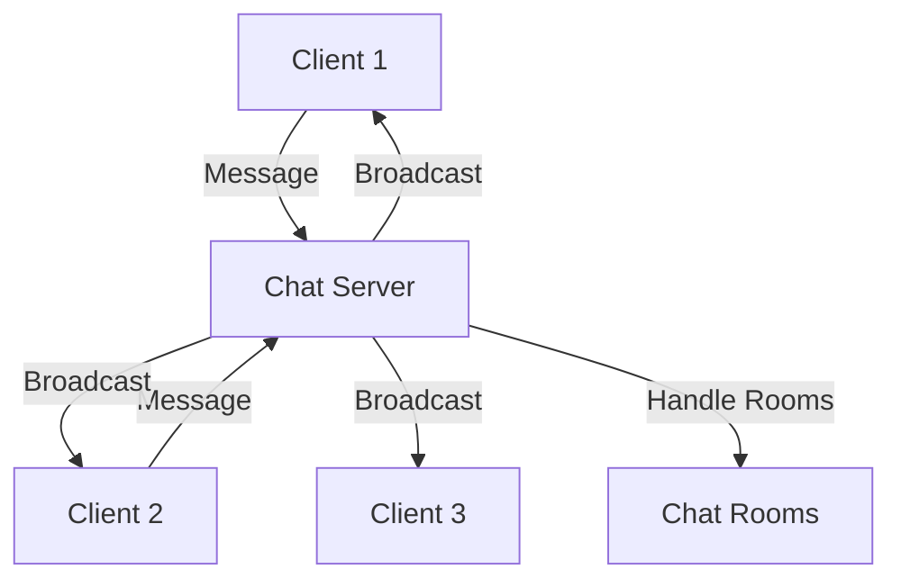

# Real-Time-Chat 📡💬  

**A dynamic and user-friendly Python-based application for real-time text communication across rooms, powered by a multithreaded client-server architecture.**

---

## Table of Contents  
- [Overview](#overview)  
- [Architecture Diagram](#architecture-diagram)  
- [Features](#features)  
- [Installation](#installation)  
- [Usage](#usage)  
- [Contributing](#contributing)  
- [Known Issues and Future Plans](#known-issues-and-future-plans)  
- [License](#license)  

---

## Overview  
Real-Time-Chat is a Python-based client-server application that allows users to join chat rooms, communicate in real-time, and experience seamless interaction with other users in the same room. Built with simplicity in mind, the application leverages `socket` programming and `tkinter` for networking and graphical interfaces.

---

## Architecture Diagram  



---

## Features  
✅ **Real-time messaging** across multiple chat rooms.  
✅ **Multi-client support** for scalability.  
✅ **User-friendly UI** using `tkinter`.  
✅ **Server-side room management** for grouped communication.  
✅ **Error handling** for connection stability.  

---

## Installation  

### Prerequisites  
Ensure Python 3.10+ is installed. Dependencies include:  
- `socket` (standard library)  
- `tkinter` (standard library)  

### Step 1: Clone the Repository  
```bash  
git clone https://github.com/Caio-Felice-Cunha/Real-Time-Chat.git  
cd Real-Time-Chat  
```  

### Step 2: Start the Server  
Run the server script to initialize the backend:  
```bash  
python server.py  
```  

### Step 3: Run the Client  
For each user, execute the client script:  
```bash  
python client.py  
```  

---

## Usage  

1. **Starting the Server:**  
   - The server listens on `127.0.0.1:55555` by default.  
   - Once started, it handles room creation and message broadcasting.  

2. **Launching the Client:**  
   - Users enter their name and room details in a graphical dialog.  
   - They can then send and receive messages in real-time.

---

## Contributing  

Contributions are welcome! Follow these steps to contribute:  

### Step 1: Fork the Repository  
Click the **Fork** button on the GitHub page to create your own copy.  

### Step 2: Clone Your Fork  
```bash  
git clone https://github.com/your-username/Real-Time-Chat.git  
cd Real-Time-Chat  
```  

### Step 3: Set Up Development Environment  
- Install a virtual environment:  
  ```bash  
  python -m venv env  
  source env/bin/activate  # On Windows: env\Scripts\activate  
  ```  
- Install required dependencies:  
  ```bash  
  pip install -r requirements.txt  
  ```  

### Step 4: Submit Your Changes  
- Make your changes and test thoroughly.  
- Commit your work:  
  ```bash  
  git commit -m "Descriptive commit message"  
  ```  
- Push to your fork:  
  ```bash  
  git push origin your-branch  
  ```  
- Create a pull request on the original repository.  

---

## Known Issues and Future Plans  

### Known Issues  
- 🟠 **No persistence:** Rooms and messages do not persist after server shutdown.  
- 🟠 **Limited error handling:** Room creation and joining errors need refinement.  

### Future Plans  
- 🟢 **Add persistence:** Implement a database for room and message history.  
- 🟢 **Enhanced UI:** Introduce message styling and additional user interactions.  
- 🟢 **Encryption:** Secure communication with TLS.  

---

## License  

This project is licensed under the MIT License. See the [LICENSE](LICENSE) file for details.  

---

Contributions, suggestions, and feature requests are highly appreciated! 😊

---

## ⚖️ Credits

This project was developed as part of the "4 Days 4 Projects" initiative by [Pythonando](https://pythonando.com.br) on YouTube.